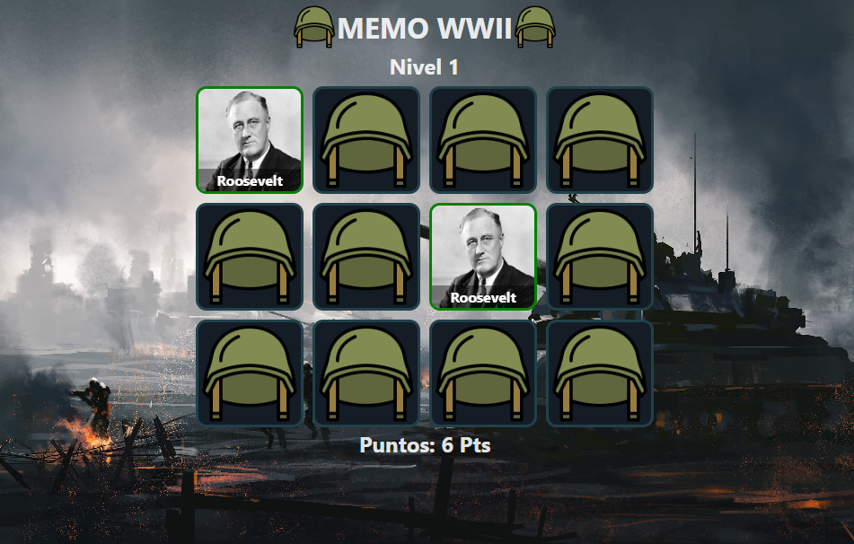
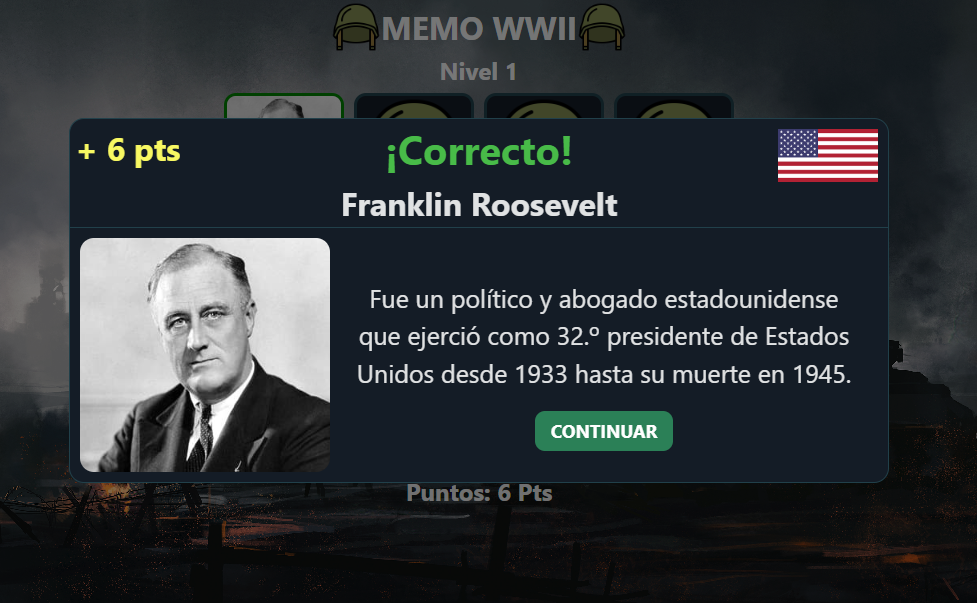
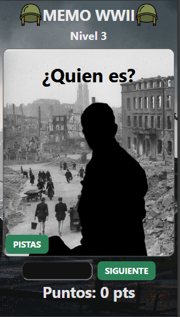

# 🧠 MemoWWII

¡Bienvenido a **MemoWWII**, un juego de memoria interactivo diseñado para ayudar a los estudiantes de secundaria a aprender sobre la Segunda Guerra Mundial de manera entretenida y educativa! A través de este juego, los alumnos pueden mejorar su conocimiento sobre eventos históricos clave mientras desarrollan habilidades cognitivas.

|  |  |  |
| ----------------------------------------- | ---------------------------- | --------------------------------------- |

## 🚀 Características

- 🧩 **Juego de memoria educativo**: Emparejá cartas relacionadas con eventos, personajes y lugares significativos de la Segunda Guerra Mundial.
- 📖 **Contenido histórico**: Cada par de cartas viene con información adicional para profundizar el aprendizaje.
- 📱 **Diseño responsivo**: Compatible con computadoras, tablets y teléfonos móviles.
- 🎨 **Interfaz amigable**: Diseñado para ser intuitivo y atractivo para estudiantes de secundaria.

## 🖥️ Demo en Producción

🔗 [**Accedé a la App**](https://memo-ww2.vercel.app/)

## 🛠️ Tecnologías utilizadas

- **React**
- **TypeScript**
- **CSS Modules**
- **Zustand**

## 🎯 Objetivo Educativo

El objetivo principal de **MemoWWII2** es ofrecer a los estudiantes una forma interactiva y divertida de aprender sobre la Segunda Guerra Mundial, reforzando su memoria y comprensión de eventos históricos clave.

## 📦 Cómo clonar y correr el proyecto

Si querés correr esta app en tu máquina local, seguí estos pasos:

1. **Clonar el repositorio**:

   ```bash
   git clone https://github.com/mterrera29/MemoWWII2.git
   ```

2. **Entrar al directorio del proyecto**:

   ```bash
   cd MemoWWII2
   ```

3. **Instalar las dependencias**:

   ```bash
   npm install
   ```

4. **Ejecutar el servidor de desarrollo**:

   ```bash
   npm run dev
   ```

   Luego, abrí tu navegador y entrá a `http://localhost:5173` para ver la app en acción.
